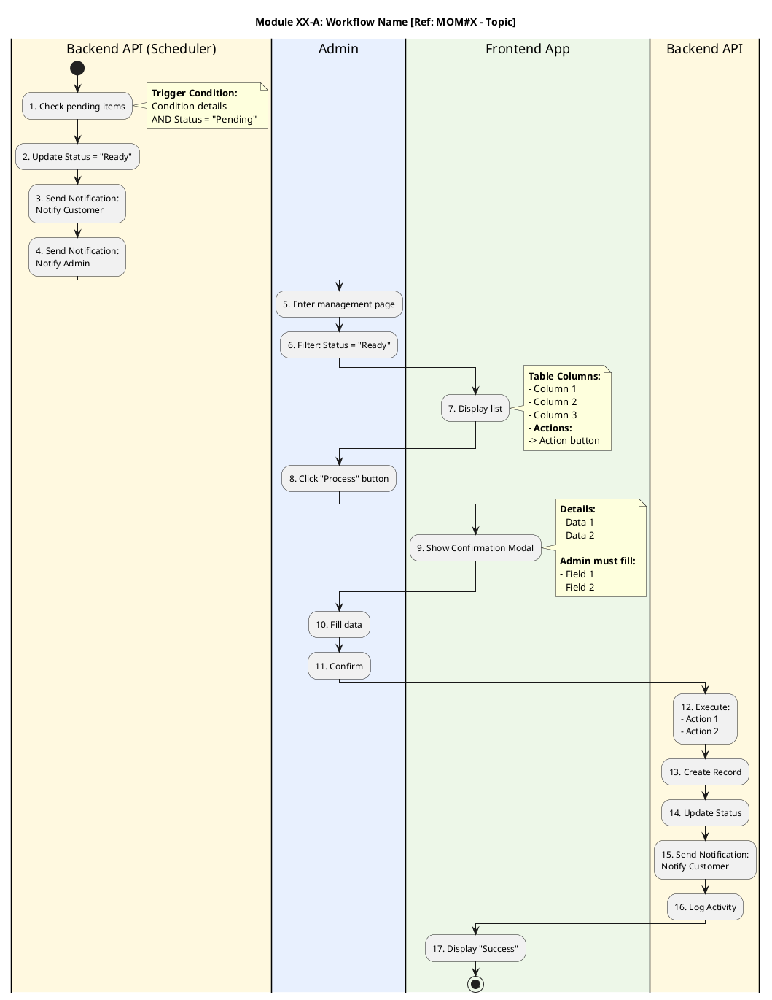

# PMO Skill: Activity Diagram (Swimlane)

> **Related Skills:**
> - Always load `pmo-lark-plantuml` when writing .puml files
> - Load `references/case-analysis.md` for detailed case examples
> - Load `references/case-checklist.md` for the 20-item checklist
> - Load `references/mom-validation.md` for MOM Validation Workflow

---

## 1. Always Use PlantUML Activity Diagram (Swimlane)

Every diagram must use Swimlane syntax separating lanes by actor/system:

```
|#BackgroundColor|Actor Name|
```

---

## 2. Ask Actor Before Creating

**Must ask user every time before creating a diagram:**
- How many actors/systems?
- What is each actor's name? (e.g., Backend API, Admin, Frontend App, Customer App)

Never assume actors without asking (unless user specifies them all in the request).

---

## 3. Lane Background Colors by Actor

| Type | Color | Hex Code | Example Actor |
|------|-------|----------|---------------|
| Backend / API / Scheduler | Cream yellow | `#FFF9E0` | Backend API, Cron Job |
| Admin / Back-office User | Light blue | `#E8F0FE` | Admin, Admin (Finance) |
| Frontend / UI | Light green | `#EDF7E8` | Frontend App, Customer App |
| External / 3rd Party | Light purple | `#F3E5F5` | Payment Gateway, SMS Provider |
| Customer / End User | Light pink | `#FCE4EC` | Customer, User |

Additional colors for extra actors:

| Color | Hex Code |
|-------|----------|
| Light gray | `#ECEFF1` |
| Light teal | `#E0F7FA` |
| Light orange | `#FFF3E0` |

---

## 4. Syntax Rules

### 4.1 Title
Format: `Module XX-X: Workflow Name [Ref: MOM#X - Topic]`

```
title Module 05-A: Order Approval Workflow [Ref: MOM#2 - Approval Process]
```

### 4.2 Activity Steps - Sequential Numbering

Every step must have a sequential number prefix, continuous across lanes:

```
:1. First action;
:2. Second action;
:3. Third action\nAdditional detail\nSecond line;
```

### 4.3 Note - Use `note right` with Bold Header

```
note right
**Bold Header:**
- Detail 1
- Detail 2
- **Actions:**
-> Button/Action
end note
```

### 4.4 Section Comment

```
' --- Section Name ---
```

### 4.5 Lane Switching

Declare lane every time actor changes:

```
|#FFF9E0|Backend API|
:1. Backend work;

|#E8F0FE|Admin|
:2. Admin work;

|#EDF7E8|Frontend App|
:3. Display screen;
```

---

## 5. Auto-Split Large Flow (Mandatory)

**AI ต้องประเมินขนาด flow ก่อนเริ่มเขียน — ถ้าเกิน threshold ต้องแบ่งอัตโนมัติ โดย user ไม่ต้องบอก**

### 5.1 Threshold (ตรงเงื่อนไขข้อใดข้อหนึ่ง = ต้องแบ่ง)

| เงื่อนไข | Threshold |
|----------|-----------|
| จำนวน Activity | > 20 activities ใน flow เดียว |
| จำนวน Swimlane | > 4 lanes |
| Nested Decision | > 2 ระดับซ้อนกัน (if ใน if ใน if) |
| Sub-process ชัดเจน | มี process ที่แยกเป็นกลุ่มงานได้ (เช่น Payment, Notification, Approval) |

### 5.2 Numbering & Naming

- Use: **Module X-A**, **Module X-B**, **Module X-C**, ..., **Module X-Z**
- Each sub-diagram has its own `@startuml` and `@enduml`
- ไฟล์แยกกัน: `BOF-SysF-07-A_WithdrawRequest.puml`, `BOF-SysF-07-B_WithdrawApproval.puml`

### 5.3 Connector Notes (จุดเชื่อม)

ทุก sub-flow ต้องมี connector note ที่จุดเริ่มและจุดจบ:

```plantuml
' --- จุดเริ่ม (ถ้าต่อจาก flow อื่น) ---
note right
**→ ต่อจาก:** Module XX-A Step 15
**Context:** User ส่งคำขอแล้ว รอ Admin อนุมัติ
end note

' --- จุดจบ (ถ้ามี flow ต่อ) ---
note right
**→ ต่อที่:** Module XX-C Step 1
end note
```

### 5.4 Master Index (ถ้ามี > 3 sub-flows)

ใส่ที่ flow แรก (Module XX-A) ใต้ title:

```plantuml
note right
**Module XX ประกอบด้วย:**
- **XX-A:** ยื่นคำขอ (Step 1-15)
- **XX-B:** อนุมัติ/ปฏิเสธ (Step 16-28)
- **XX-C:** แจ้งผล + บันทึก (Step 29-38)
end note
```

### 5.5 ขั้นตอนปฏิบัติ

1. **ก่อนเขียน** → นับจำนวน activities, lanes, decision depth จาก REQ/MOM
2. **ถ้าเกิน threshold** → วางแผนแบ่ง + นำเสนอ user ก่อน (เช่น "Module 05 มี ~35 steps จะแบ่งเป็น 3 ส่วน")
3. **รอ user approve** → เริ่มเขียนทีละ sub-flow
4. **ถ้าระหว่างเขียนเกิน** → หยุดแล้วแบ่ง ณ จุดที่เหมาะสม (decision point หรือ lane switch)

---

## 6. Full Template



---

## 7. SystemFlow vs UserFlow

|  | System Flow | User Flow |
|--|------------|-----------|
| **For** | Dev Team, Tech Lead | Client, PM, Stakeholder |
| **Actors** | **All:** Admin, Backend API, Scheduler, 3rd Party, Customer | **Users only:** Customer, Admin + "System" (combined Backend/Scheduler/3rd Party) |
| **Detail** | Error handling, Audit log, API call, Retry logic, technical terms | Actions user sees + results + **important logic/conditions affecting next flow** |
| **Save to** | `SystemFlow/` | `UserFlow/` |
| **File naming** | `{Platform}-SysF-{XX}_{Name}.puml` | `{Platform}-UseF-{XX}_{Name}.puml` |
| **Created when** | Steps 1-4 of Workflow | Step 5 - Derived from Final System Flow |

### User Flow Must Include / Exclude

| Must Include | Don't Include |
|-------------|--------------|
| Decision points affecting next action | API call / endpoint details |
| Business logic client must know | Audit log / Logging details |
| Results of each choice affecting next flow steps | Server-side retry/error handling |
| Notifications user receives | Internal system notifications |
| Messages/status user sees on screen | Database operation details |

**Use business language, not technical jargon:**
- Replace `Backend API validates...` -> `System verifies data...`
- Replace `POST /api/orders` -> `System creates order`
- Replace `Cron job triggers` -> `System runs automatically`

---

## 8. File Naming Convention

| Type | Format | Example |
|------|--------|---------|
| **System Flow** | `{Platform}-SysF-{XX}_{Name}.puml` | `BOF-SysF-01_AdminLogin.puml` |
| | | `BOF-SysF-07-A_WithdrawApproval.puml` |
| **User Flow** | `{Platform}-UseF-{XX}_{Name}.puml` | `BOF-UseF-01_AdminLogin.puml` |
| **Combined** | `{Platform}-SysF-ALL_Combined.puml` | `BOF-SysF-ALL_Combined.puml` |
| **Traceability** | `REQ_Traceability_Matrix.md` | In `SystemFlow/` |

**Platform prefix:**

| Prefix | Meaning |
|--------|---------|
| `BOF` | Back Office |
| `CSA` | Customer App (CS App) |
| *(others per project)* | |

> **UseCase/ folder remains separate** - Use Case Diagram is a different diagram type from User Flow.
