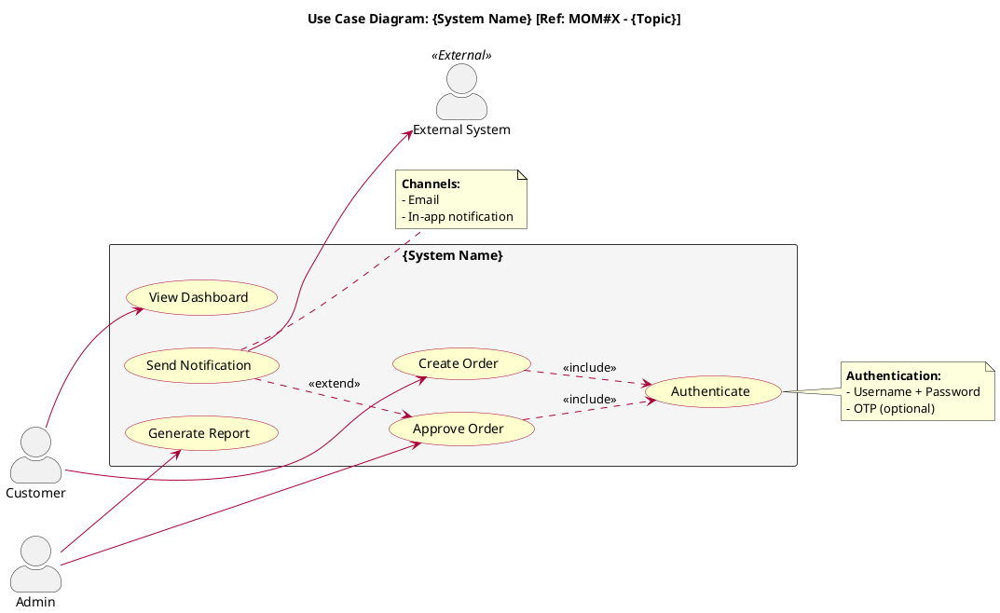

# PMO Skill: Use Case Diagram

> **Related Skills:** Also load `pmo-lark-plantuml` when writing .puml files.
> Load `references/use-case-checklist.md` for validation checklist (7 ข้อ) before finalize.

Use this skill when creating PlantUML Use Case Diagrams. Save output in `./<ProjectName>/UseCase/`

---

## Pre-requisites: Ask Before Creating

**Must ask the user:**
- How many Actors? What are their names?
- What is the System boundary name?
- Are there Sub-systems?

Never assume actors or use cases without asking.

---

## Syntax Reference

### Actor

```plantuml
' Keyword style
actor Customer
actor "System Admin" as SA

' Colon style
:Customer:
:System Admin: as SA
```

### Use Case

```plantuml
' Parenthesis style
(Login)
(Place Order)
(View Report) as UC1

' Keyword style
usecase "Place Order" as UC2
usecase UC3 as "Multi-line
Use Case Name"
```

### System Boundary (Rectangle)

```plantuml
rectangle "System Name" {
  (Use Case 1)
  (Use Case 2)
}

' Nested sub-system
rectangle "Main System" {
  rectangle "Sub-system A" {
    (Feature 1)
  }
}
```

### Relationship Types

| Relationship | Syntax | Line | Arrow | Label |
|-------------|--------|------|-------|-------|
| **Association** | `Actor -- (UC)` or `Actor --> (UC)` | Solid | Open/none | Optional |
| **Include** | `(UC1) ..> (UC2) : <<include>>` | Dashed | Open | `<<include>>` |
| **Extend** | `(UC1) ..> (UC2) : <<extend>>` | Dashed | Open | `<<extend>>` |
| **Generalization** | `Child --|> Parent` | Solid | Filled triangle | None |

**Arrow direction rules:**
- **Include:** Arrow from base use case to included use case
- **Extend:** Arrow from extending use case to base use case
- **Generalization:** Triangle points to parent

```plantuml
' Include: Place Order always requires Authenticate
(Place Order) ..> (Authenticate) : <<include>>

' Extend: Apply Coupon is optional for Checkout
(Apply Coupon) ..> (Checkout) : <<extend>>

' Generalization: Premium Customer inherits from Customer
:Premium Customer: --|> :Customer:

' Use Case Generalization
(Pay by Credit Card) --|> (Make Payment)
```

### Direction Control

```plantuml
left to right direction    ' Change layout from top-to-bottom to left-to-right

' Force arrow direction
Actor -left-> (UC1)
Actor -right-> (UC2)
Actor -up-> (UC3)
Actor -down-> (UC4)
```

### Note

```plantuml
note right of (Login)
  **Pre-condition:**
  - User must have account
  **Post-condition:**
  - Session created
end note

' Standalone note
note "General note" as N1
(Login) .. N1
```

### Styling

```plantuml
skinparam actorStyle awesome          ' Nice icon style
skinparam usecase {
  BackgroundColor #FEFECE
  BorderColor #A80036
}
skinparam rectangle {
  BackgroundColor #F1F1F1
  BorderColor #333333
}
skinparam shadowing false
```

---

## Full Template



---

## Use Case Diagram Checklist

**Verify before finalizing:**

| # | Category | Question |
|---|---------|---------|
| 1 | **Actor Complete** | Every Role / external system that interacts with the system appears in the diagram? |
| 2 | **Use Case Complete** | Every Functional Requirement converted to a Use Case? |
| 3 | **System Boundary Correct** | Use Cases inside the system are in the rectangle, outside are outside? |
| 4 | **Include Correct** | Use Cases that must **always** call another use case have `<<include>>`? |
| 5 | **Extend Correct** | Use Cases that are **optional** behavior have `<<extend>>`? |
| 6 | **Generalization Correct** | Any Actor or Use Case inheritance relationships identified? |
| 7 | **Not Too Detailed** | Use Cases are at "user goal" level, not UI step level? |

---

## File Naming

| Type | Format | Example |
|------|--------|---------|
| **Use Case** | `UC-{XX}_{Name}.puml` | `UC-01_AuthAccessControl.puml` |
