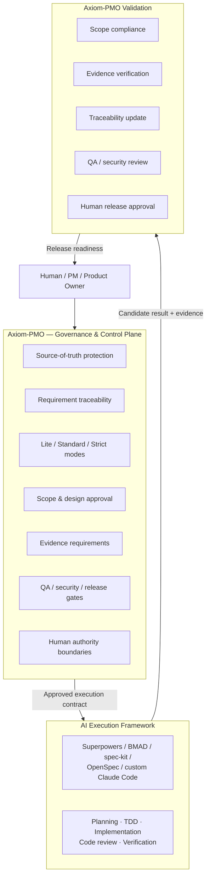

<!-- markdownlint-disable MD033 MD041 -->
<div align="center">

# Axiom-PMO

### The Anti-Hallucination Framework for AI Agents

A deterministic governance layer that keeps AI coding agents inside **verified
requirements, approved scope, traceable evidence, and human-controlled release
gates.**

[](https://github.com/witchwasin/Axiom-PMO/actions/workflows/pmo-checks.yml)
[](LICENSE)
[](CHANGELOG.md)

<sub>Version <code>1.0.0</code> · MIT License · Windows PowerShell reference implementation (Linux/macOS via <code>pwsh</code>, experimental)</sub>

</div>

---

> **AI agents can write code. They should not invent the project.**

AI coding frameworks help agents build faster. Axiom-PMO exists to make sure
they build the *right* thing — from requirements that trace back to real source
material, within a scope a human approved, with evidence for every claim, and
with releases that no agent can authorize on its own.

Axiom-PMO is **not** an execution framework and does not try to replace one. It
is the **governance control plane** those frameworks can operate inside.

---

## The problem

Left unconstrained, an AI agent doing project or delivery work tends to:

- **invent** requirements, acceptance criteria, actors, or approvals that were
  never actually given;
- **silently expand scope** — adding "helpful" features nobody asked for;
- **claim evidence** ("tests pass", "QA approved") that it generated itself and
  that no one verified;
- **lose traceability** between what a stakeholder asked for and what was built
  and tested; and
- **cross authority boundaries** — committing, pushing, or "releasing" without a
  human ever saying yes.

A prompt that politely asks the agent not to do these things is not a control.
Axiom-PMO turns each of them into a **machine-verifiable contract** enforced by a
validator that exits non-zero when the contract is broken — the same way a
linter fails a pull request.

> See [`case-studies/unauthorized-git-mutation.md`](case-studies/unauthorized-git-mutation.md)
> — *"The Agent That Shipped Without Permission"* — for the incident that shaped
> these controls. The code may have been fine. The authorization was part of the
> specification, and it was missing.

## What Axiom-PMO does

Every important claim — a requirement, a design decision, a test result, an
approval — must carry a **source reference** and an **evidence status**
(`verified`, `supported`, `inferred`, `missing`, or `conflict`). Those claims
are then run through a **deterministic PowerShell validator** that fails the gate
if something is missing, placeholder text, unresolvable, or unapproved. Nothing
is enforced by asking the agent nicely.

- **Source-of-truth protection** — `source/` inputs are user-owned; the agent
  never edits, creates, or deletes them.
- **Requirement traceability** — source → requirement → design → delivery →
  test → evidence → release, checked row by row (full chain in Strict mode via
  `RTM.json`).
- **Risk-adaptive modes** — Lite / Standard / Strict decide *how much* process
  is required for a given piece of work.
- **Human authority boundaries** — the agent may recommend the next gate but may
  not approve its own work, and may not commit, push, tag, deploy, or approve a
  release by itself.

## Architecture: control plane + execution plane

Axiom-PMO governs *what and why*; an execution framework handles *how*. Output
from the execution framework is **candidate evidence**, not automatically trusted
truth — Axiom-PMO validates it before it becomes release-ready.



**Responsibility split**

| Axiom-PMO owns | An execution framework owns |
|---|---|
| Source, requirements, scope, risk | Implementation planning |
| Approvals and evidence policy | TDD and coding |
| Release authority | Code review and engineering verification |

The execution framework **may not** change approved scope, alter acceptance
criteria without a change request, downgrade risk mode, mark QA/security/release
approved, or deploy without human permission.

## Works alongside your AI framework

Axiom-PMO is framework-agnostic. It defines *what may be built and when it is
safe to release*; your execution framework defines *how it gets built*.

| Capability | Axiom-PMO | Execution frameworks (Superpowers / BMAD / spec-kit / OpenSpec) |
|---|---|---|
| Requirement & scope governance | Primary | Limited / partial |
| Human approval gates | Strong | Limited / partial |
| Source-ownership boundary | Strong | Not primary |
| Machine-tested process rules | Strong | Engineering / workflow / spec-focused |
| Release evidence governance | Strong | Verification-focused |
| Planning · TDD · implementation | Delegated | Strong |
| Governance control plane | Primary | Not primary |

> Axiom-PMO does not attempt to replace these frameworks. It provides the
> governance layer they can operate inside. Individual elements here have prior
> art; the differentiation is combining risk-adaptive PM governance, source
> protection, human authority boundaries, full-chain traceability, and
> deterministic validation into one lightweight control plane for small
> AI-assisted teams.

See [`docs/integrations/overview.md`](docs/integrations/overview.md) for the
Level 0–4 interoperability model and authority-precedence order.

## The three modes

Every project — and every individual work item inside it — declares a mode. The
mode decides how much process is *required*, not how much is *allowed*.

| Mode | Use for | What's required |
|---|---|---|
| **Lite** | Small, low-risk fixes and clarifications | `PROJECT.md`, one delivery item, acceptance criteria, a test note. |
| **Standard** | Normal feature delivery | Above, plus a design artifact when there's a flow/UI, `DELIVERY.md` or GitHub Issues, a real test checklist, QA sign-off at release. |
| **Strict** | Payment, PII, auth, permissions, external integrations, compliance, production data migration, or any other trigger in [`AGENTS.md`](AGENTS.md) | Everything Standard requires, plus full source references on every claim, a RAID log, a decision log, a requirement-to-release traceability matrix (`RTM.json`), and QA **and** security sign-off. |

A project can never be silently downgraded: if a work item carries a Strict
trigger, the validator forces the whole project's effective mode to Strict even
if you pass `-Mode Lite` on the command line.

## Quick start

Requires PowerShell (Windows PowerShell 5.1 or PowerShell 7 / `pwsh`).

```powershell
# 1. Generate a new project skeleton (mode-aware)
powershell -ExecutionPolicy Bypass -File scripts/new-project.ps1 -ProjectCode P02-MYPROJECT -Mode Standard

# 2. Put real source under source/MOM, source/REQ, source/Transcript
#    (user-owned; the agent never edits these)

# 3. Fill PROJECT.md from source — every requirement needs a
#    source_ref and an evidence_status

# 4. Validate before every gate
powershell -ExecutionPolicy Bypass -File scripts/validate-project.ps1 `
  -ProjectPath projects/P02-MYPROJECT -Mode Standard -Gate Release -FailOnWarning
```

Or start from a worked example: [`examples/LITE-BUGFIX`](examples/LITE-BUGFIX),
[`examples/STANDARD-FEATURE`](examples/STANDARD-FEATURE),
[`examples/STRICT-HIGH-RISK`](examples/STRICT-HIGH-RISK), or the fuller
[`examples/P01-DEMO`](examples/P01-DEMO).

On Linux/macOS or with `make` installed, the same checks are available through
convenience wrappers (experimental — they call the PowerShell reference
implementation via `pwsh`):

```bash
make check      # doctor + validation + mutation + e2e
./scripts/check.sh   # equivalent wrapper
```

## Validate the framework itself

Beyond validating individual *projects*, Axiom-PMO validates *itself* — proving
its scripts, configs, and skills are internally consistent:

```powershell
powershell -ExecutionPolicy Bypass -File scripts/pmo-doctor.ps1            # framework health
powershell -ExecutionPolicy Bypass -File scripts/run-validation-tests.ps1  # positive/negative fixture matrix + golden master
powershell -ExecutionPolicy Bypass -File scripts/run-all-checks.ps1        # everything + config-mutation + end-to-end
```

The test suite includes a positive/negative fixture matrix, byte-for-byte golden
masters, config-mutation tests (which prove the JSON policy files are load-bearing,
not decorative), and generator-to-release end-to-end flows. See
[`TESTING.md`](TESTING.md).

## Repository layout

```
AGENTS.md, CLAUDE.md, CONTEXT-ROUTER.md   Agent behavior rules and routing (read first if you're an agent)
TESTING.md, SECURITY.md, MIGRATION.md     Test tooling, security rules, legacy-layout migration
templates/                                Blank PROJECT.md / DELIVERY.md / RELEASE.md / RTM.json / etc.
examples/                                 Worked example projects (Lite, Standard, Strict, and a demo)
scripts/                                  The validator, framework doctor, and project generator
  scripts/lib/                              The validator's modules (config, parsing, per-rule checks, output)
pmo-config/                               Runtime policy as JSON — the source of truth the scripts read
.claude/skills/                           The 7 active AI skills (one per workflow stage)
docs/                                     Concepts, architecture, governance, integrations, tutorials, per-mode guides
integrations/                             Experimental execution-contract schemas (framework interop)
case-studies/                             Governance lessons (e.g. the unauthorized-git-mutation incident)
tests/                                    Fixture matrix + golden masters + config-mutation + end-to-end tests
reports/                                  Public release baseline and sanitized project-history archive
```

A project built with this template looks like:

```
PROJECT.md          Scope, requirements, approvals — the "what" and "why"
source/             Client-owned inputs (MOM, REQ, Transcript, Others) — never edited by the AI
DESIGN/             Flow diagrams, wireframes (Standard/Strict, when there's a UI or flow)
DELIVERY.md         Work items — the "who's building what", unless GitHub Issues is the declared source
RELEASE.md          Release scope, test summary, QA/security review, rollback plan, release approval
RAID-log.md         Risks/assumptions/issues/dependencies (Strict, or when meaningful)
decision-log.md     Logged decisions (Strict, or when meaningful)
RTM.json            Requirement → design → delivery → test → evidence → release traceability (Strict)
```

## The AI skill system

An agent loads only the skill relevant to the task at hand — never all of them —
to keep context small and focused. `CLAUDE.md` routes user intent to the right
skill and mode.

| Skill | Stage |
|---|---|
| `pmo-intake` | Turning source material into scoped, referenced requirements |
| `pmo-design` | Flow, UX, wireframes, design-ready acceptance criteria |
| `pmo-delivery` | Delivery planning, handoff, task-source-of-truth, sequencing |
| `pmo-build-review` | Build completion evidence, code-review readiness |
| `pmo-quality-release` | QA evidence, release readiness, rollback review |
| `pmo-governance` | RAID, decisions, traceability, risk, Strict-mode guardrails |
| `pmo-git-safety` | Branch/diff/sensitive-file checks before commit, push, or tag |

## Human authority model

- The AI never invents requirements, actors, dates, or approvals.
- Every important claim is tagged `Confirmed`, `Assumption`, or `Open Question`,
  and carries a `source_ref` and an `evidence_status`.
- `source/`, `MOM/`, `REQ/`, `Transcript/`, `Others/` are user-owned — never
  edited, created, or deleted by the AI.
- The AI never commits, pushes, tags, deploys, or approves a production release
  or business scope by itself. Those require explicit human confirmation every
  time — not a standing permission.

Full rules: [`AGENTS.md`](AGENTS.md). Security specifics: [`SECURITY.md`](SECURITY.md).

## Security

Sensitive source (PII, financial data, customer-confidential data) stays local
and triggers Strict mode. The framework does a sensitive-file pre-check, not a
full secret scan. Report vulnerabilities per [`SECURITY.md`](SECURITY.md).

## Contributing

Contributions are welcome — especially validation rules, fixtures, and
interoperability docs. The one hard rule: **do not weaken governance to make
tests pass.** See [`CONTRIBUTING.md`](CONTRIBUTING.md) and
[`CODE_OF_CONDUCT.md`](CODE_OF_CONDUCT.md). AI-assisted contributions are welcome
but must be disclosed and human-reviewed.

## Roadmap

The productization roadmap is tracked in [`ROADMAP.md`](ROADMAP.md). It is the
current roadmap of record for turning Axiom-PMO from a governance framework into
a developer workflow tool for AI-assisted software delivery.

Near-term priorities are:

- public trust plus a three-minute demo;
- structured developer diagnostics and a stable JSON result schema;
- a thin local CLI before any public npm package;
- a GitHub Action that reports governance failures directly in pull requests;
- one complete Superpowers bridge before broader ecosystem expansion.

The roadmap is intended to be reviewed weekly. Suitable community issues,
integration requests, and developer feedback may be accepted into the roadmap
when they strengthen the product direction without weakening governance.

## License

[MIT](LICENSE) © 2026 WITCHWASIN K.

## Project status

Version `1.0.0` — first public release. The validation engine and governance
model are stable; interoperability automation is on the roadmap. Migrating from
the previous private layout? See
[`docs/migration/from-pmo-template-personal.md`](docs/migration/from-pmo-template-personal.md).
