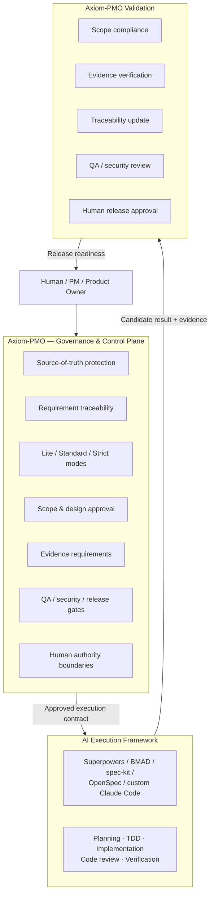

# Axiom-PMO

### The governance control plane for AI-assisted software delivery.

A repo-native, deterministic governance layer that keeps AI coding agents
inside **verified requirements, approved scope, traceable evidence, and
human-controlled release gates.**

**Axiom-PMO prepares and verifies development handoffs.<br>It does not replace
developers or execution frameworks.**

[](https://github.com/witchwasin/Axiom-PMO/actions/workflows/pmo-checks.yml)
[](LICENSE)
[](CHANGELOG.md)

Version `2.0.0` · MIT License · PowerShell reference implementation (Windows
PowerShell 5.1 and PowerShell 7; Linux/macOS via `pwsh`)

---

> **AI agents can write code. They should not invent the project.**

## What this repository is for

Axiom-PMO is a **governance and development-handoff framework**. You use it to
get a piece of work to the point where a developer — or an AI execution tool —
can pick it up and build it, and to check afterwards that what was reported
actually matches the evidence and the repository.

| Axiom-PMO does | Axiom-PMO does not |
|---|---|
| Turn source material into scoped, traceable requirements | Write your system |
| Check design readiness and handoff completeness | Replace your developers |
| Verify scope, tests, evidence, and authority | Replace your execution framework |
| Check that an AI's report matches real repository state | Act as the repo you build the product in |

**Milestones 1–7 are the core product**, including onboarding (`axiom init`)
and the two execution paths. Milestone 6 — the Claude Code integration — is
an **optional bridge**, for teams who decide to continue implementation with
Claude Code after the handoff is verified; Milestones 8.0, 8.1, and 9 are
**optional, adjacent governance capabilities** — adversarial review evidence
and a local failure-pattern registry — that a project can use fully without
ever touching. You never need any of them to use Axiom-PMO. See
[ROADMAP.md](ROADMAP.md#core-product-versus-optional-integration).

## Two delivery paths, one governance model

Axiom-PMO answers two independent questions about a piece of work, not one:

```text
Axis 1 — who builds it?               Development Handoff | Governed AI Execution
Axis 2 — how strictly is it governed?  Lite | Standard | Strict
```

| | **Development Handoff** | **Governed AI Execution** |
|---|---|---|
| What it is | Prepare requirements, scope, design, and a work package a human developer or vendor can pick up and build | Hand an approved work item to an AI execution agent under a contract, then verify what it actually did against git ground truth |
| The mechanism | The Handoff gate (`axiom handoff`) | `axiom export` → agent implements → `axiom run` → `axiom verify` |

Both paths support all three governance modes — a vendor handoff can be
Strict; a governed AI execution can be Lite. `axiom init` asks which path and
which mode directly:

```bash
node cli/axiom.mjs init
```

Running interactively (on a TTY), it asks who will build the work, then what
level of governance it needs — with a **Help me decide** option that asks a
short series of yes/no questions and recommends Strict when one applies. Every
answer is a **declaration you make**, never something the tool claims to have
detected — there is no source material yet at `init` time to detect anything
from. See [`docs/concepts/execution-paths.md`](docs/concepts/execution-paths.md).

Non-interactively (CI, scripts, `--no-interactive`), pass flags as before:

```bash
node cli/axiom.mjs init --code P02-ABC --mode Standard --execution-path governed_ai_execution
```

Once a project exists, `axiom status` reports where it stands without having
to re-read this file:

```bash
node cli/axiom.mjs status --project P02-ABC
```

Projects may also declare two optional branches. Research is optional and
happens before Scope approval; Claude Design is an optional governed provider
handoff for the UI. Both stay silent until declared, and neither can approve or
rewrite Scope — only a traceable Human decision can do that:

```text
Research:    off | guided | auto
UI delivery: not_applicable | dev_guided | claude_design
```

- Guided/auto research produces `RESEARCH/RESEARCH.md` and
  `RESEARCH/PROVENANCE.json`; every material claim maps to a resolvable
  source, an accepted proposal needs a named Human decision, and an
  unresolved accepted-impact proposal blocks Scope.
- Externalization records every transfer that leaves the governed boundary in
  `EXTERNALIZATION.json`; Confidential/Restricted transfers require named
  Human evidence, and a declared clean scan must agree with a deterministic
  re-scan.
- Claude Design receives a digest-bound input manifest
  (`DESIGN/CLAUDE-DESIGN/INPUT-MANIFEST.json`), returns output to
  `DESIGN/CLAUDE-DESIGN/OUTPUT/**`, and is accepted only by a named Human in
  `DESIGN/CLAUDE-DESIGN/REVIEW.json`.

See [research workflow](docs/concepts/research-workflow.md),
[externalization](docs/concepts/externalization.md), and
[Claude Design workflow](docs/concepts/claude-design-workflow.md). System
Design and initial Test Strategy live in `DESIGN/BUILD-SPEC.md` before
detailed UI work. See the
[end-to-end workflow](docs/concepts/end-to-end-workflow.md).

### Actor legend and compact flow

`[H-IN]` Human input · `[AI-A]` AI-assisted · `[AI-R]` AI-run · `[EXT]`
external tool · `[SYS]` deterministic validator · `[HG]` Human gate

```text
[H-IN] Source -> [AI-R] Intake -> choose execution path + Lite/Standard/Strict
  -> optional Research? (off | guided | auto)
       no -> continue
       yes -> [SYS/HG] Externalization -> [AI-R/EXT] provider research
              -> [AI-R] Impact proposal (never automatic Scope)
  -> [SYS] Scope validation -> [HG] Scope Approved
  -> [AI-A] System Design + Test Strategy in BUILD-SPEC
  -> UI delivery: dev-guided flow | Claude Design
       (manifest -> output -> preflight -> AI review -> Human review)
  -> [AI-R] Acceptance Cases + Final Handoff -> [SYS] Handoff checks -> [HG] Design Ready
  -> developer build | governed AI contract
  -> [AI-A/SYS/HG] Controlled Change loop when reality differs
  -> [SYS] evidence/release checks -> [HG] Release Approved
```

Humans answer ambiguity and own approvals. AI drafts candidate evidence and
deterministic validators check what code can prove; `auto` never means automatic
Scope, Design, risk, or Release approval.

## Quick start

Requires PowerShell (Windows PowerShell 5.1 or PowerShell 7 / `pwsh`). The CLI
additionally needs Node.js; everything it does is also available by calling the
scripts directly.

```bash
# See the framework catch something real
node cli/axiom.mjs demo

# Start a project, with handoff scaffolding
node cli/axiom.mjs init --code P02-MYPROJECT --mode Standard --handoff --target demo

# Put real source under source/MOM, source/REQ, source/Transcript
# (user-owned; the agent never edits these), then fill PROJECT.md.
# Every requirement needs a source_ref and an evidence_status.

# Ask whether a developer can start
node cli/axiom.mjs handoff --project projects/P02-MYPROJECT --mode Standard

# Validate at any gate
node cli/axiom.mjs validate --project projects/P02-MYPROJECT --gate Release --fail-on-warning
```

Without Node, the same things through PowerShell:

```powershell
powershell -ExecutionPolicy Bypass -File scripts/new-project.ps1 -ProjectCode P02-MYPROJECT -Mode Standard -IncludeHandoff -Target demo
powershell -ExecutionPolicy Bypass -File scripts/validate-project.ps1 -ProjectPath projects/P02-MYPROJECT -Mode Standard -Gate Handoff
powershell -ExecutionPolicy Bypass -File scripts/assess-handoff.ps1 -ProjectPath projects/P02-MYPROJECT -Mode Standard
powershell -ExecutionPolicy Bypass -File scripts/validate-project.ps1 -ProjectPath projects/P02-MYPROJECT -Mode Standard -Gate Release -FailOnWarning
```

### The gates

```text
Draft → Scope → Design → Handoff → Build/QA → Release
```

| Gate | Asks |
|---|---|
| `Draft` | Does the project exist in a usable shape? |
| `Scope` | Is every requirement sourced and approved? |
| `Design` | Is the design ready and approved? |
| `Handoff` | **Can a developer start, integrate, and demonstrate this?** |
| `Release` | Is it tested, reviewed, approved, and reversible? |

`Handoff` introduces no new human approval — it reuses the existing
`Design Ready` sign-off and checks whether the contract is complete enough to
act on. See [handoff readiness](docs/concepts/handoff-readiness.md).

Or start from a worked example:
[`examples/LITE-BUGFIX`](examples/LITE-BUGFIX),
[`examples/STANDARD-FEATURE`](examples/STANDARD-FEATURE),
[`examples/STRICT-HIGH-RISK`](examples/STRICT-HIGH-RISK),
[`examples/HANDOFF-DEMO`](examples/HANDOFF-DEMO) (a demo handoff), the fuller
[`examples/P01-DEMO`](examples/P01-DEMO), or
[`examples/OPTIONAL-TRACKS`](examples/OPTIONAL-TRACKS) (the one canonical
Standard example combining Guided Research, the Claude Design manifest, and a
controlled change — a **synthetic fixture**: every person, meeting, provider
call, approval, and digest in it is fabricated demonstration evidence).

On Linux/macOS or with `make` installed, the same checks are available through
convenience wrappers (they call the PowerShell reference implementation via
`pwsh`):

```bash
make check      # doctor + validation + mutation + e2e
./scripts/check.sh   # equivalent wrapper
```

### Run it as a GitHub Action

No local PowerShell install required -- GitHub-hosted runners already ship
one. Report-only by default, so a first install cannot break a pull request
nobody has configured a rule set for yet.

```yaml
- uses: witchwasin/Axiom-PMO@<pinned-sha-or-tag>
  with:
    project: projects/P02-MYPROJECT
    mode: Standard
    gate: Release
```

Full inputs, outputs, and the report contract: [docs/guides/github-action.md](docs/guides/github-action.md).

Add `enable-scope-diff: "true"` to also check that the PR's changed files
stayed inside the project's approved `SCOPE.json` -- deterministic path
matching, no LLM judging whether a file "seems related":

```yaml
- uses: actions/checkout@v7
  with:
    fetch-depth: 0   # SCOPE-DIFF needs the base commit, not just the current one
- uses: witchwasin/Axiom-PMO@<pinned-sha-or-tag>
  with:
    project: projects/P02-MYPROJECT
    gate: Release
    enable-scope-diff: "true"
```

Scope syntax, precedence, and git range semantics: [docs/reference/scope-declaration.md](docs/reference/scope-declaration.md).

## Why this matters now

AI coding agents can plan, implement, test, review, and produce their own
evidence. That creates a new governance problem: the same system performing the
work may also claim that the work is correct, complete, and approved.

Axiom-PMO keeps four things separate that AI-assisted delivery must not collapse:

1. **Source** — what a stakeholder or governed input actually said.
2. **Inference** — what an AI reasoned from incomplete information.
3. **Candidate evidence** — what execution produced and still needs verification.
4. **Human authority** — what only an authorized person may approve.

This is not prompt guidance. Axiom-PMO turns those boundaries into
**machine-testable contracts** and fails the delivery gate when the contract is
broken.

## See it in three minutes

```bash
node cli/axiom.mjs demo          # or: make demo
```

Two synthetic projects. Both have requirements traced to source, an approved
design, and a work-item board. Both pass every gate Axiom-PMO 1.0 could run.
One of them cannot be built on Monday morning — its shared schema is scheduled
after the items that consume it, its camera feature has no serving model, and a
data element it marked sensitive has no classification decision.

The demo shows the failures, shows them fixed, and then shows the part people
miss: the fixed project passes every deterministic check and *still* reports
`READY TO BUILD, NOT READY TO DEMO`. See [`demo/`](demo).

AI coding frameworks help agents build faster. Axiom-PMO exists to make sure
they build the *right* thing — from requirements that trace back to real source
material, within a scope a human approved, with evidence for every claim, and
with releases that no agent can authorize on its own.

Axiom-PMO is **not** an execution framework and does not try to replace one. It
is the **governance control plane** those frameworks can operate inside.

---

## The problem

Left unconstrained, an AI agent doing project or delivery work tends to:

- **invent** requirements, acceptance criteria, actors, or approvals that were
  never actually given;
- **silently expand scope** — adding "helpful" features nobody asked for;
- **claim evidence** ("tests pass", "QA approved") that it generated itself and
  that no one verified;
- **lose traceability** between what a stakeholder asked for and what was built
  and tested; and
- **cross authority boundaries** — committing, pushing, or "releasing" without a
  human ever saying yes.

A prompt that politely asks the agent not to do these things is not a control.
Axiom-PMO turns each of them into a **machine-verifiable contract** enforced by a
validator that exits non-zero when the contract is broken — the same way a
linter fails a pull request.

> See [`case-studies/unauthorized-git-mutation.md`](case-studies/unauthorized-git-mutation.md)
> — *"The Agent That Shipped Without Permission"* — for the incident that shaped
> these controls. The code may have been fine. The authorization was part of the
> specification, and it was missing.

## What Axiom-PMO does

Every important claim — a requirement, a design decision, a test result, an
approval — must carry a **source reference** and an **evidence status**
(`verified`, `supported`, `inferred`, `missing`, or `conflict`). Those claims
are then run through a **deterministic PowerShell validator** that fails the gate
if something is missing, placeholder text, unresolvable, or unapproved. Nothing
is enforced by asking the agent nicely.

- **Source-of-truth protection** — `source/` inputs are user-owned; the agent
  never edits, creates, or deletes them.
- **Requirement traceability** — source → requirement → design → delivery →
  test → evidence → release, checked row by row (full chain in Strict mode via
  `RTM.json`).
- **Risk-adaptive modes** — Lite / Standard / Strict decide *how much* process
  is required for a given piece of work.
- **Human authority boundaries** — the agent may recommend the next gate but may
  not approve its own work, and may not commit, push, tag, deploy, or approve a
  release by itself.

## Architecture: control plane + execution plane

Axiom-PMO governs *what and why*; an execution framework handles *how*. Output
from the execution framework is **candidate evidence**, not automatically trusted
truth — Axiom-PMO validates it before it becomes release-ready.


```mermaid
flowchart TD
    H["Human / PM / Product Owner"] --> A
    subgraph A["Axiom-PMO — Governance & Control Plane"]
        A1["Source-of-truth protection"]
        A2["Requirement traceability"]
        A3["Lite / Standard / Strict modes"]
        A4["Scope & design approval"]
        A5["Evidence requirements"]
        A6["QA / security / release gates"]
        A7["Human authority boundaries"]
    end
    A -->|"Approved execution contract"| E
    subgraph E["AI Execution Framework"]
        E1["Superpowers / BMAD / spec-kit /<br/>OpenSpec / custom Claude Code"]
        E2["Planning · TDD · Implementation<br/>Code review · Verification"]
    end
    E -->|"Candidate result + evidence"| V
    subgraph V["Axiom-PMO Validation"]
        V1["Scope compliance"]
        V2["Evidence verification"]
        V3["Traceability update"]
        V4["QA / security review"]
        V5["Human release approval"]
    end
    V -->|"Release readiness"| H
```

**Responsibility split**

| Axiom-PMO owns | An execution framework owns |
|---|---|
| Source, requirements, scope, risk | Implementation planning |
| Approvals and evidence policy | TDD and coding |
| Release authority | Code review and engineering verification |

The execution framework **may not** change approved scope, alter acceptance
criteria without a change request, downgrade risk mode, mark QA/security/release
approved, or deploy without human permission.

## Works alongside your AI framework

Axiom-PMO is framework-agnostic. It defines *what may be built and when it is
safe to release*; your execution framework defines *how it gets built*.

> **Product boundary:** Axiom-PMO does not replace Jira, Azure DevOps, Linear,
> GitHub, or an AI coding framework. It governs the scope, authority, and
> evidence that move through those systems.

| Capability | Axiom-PMO | Execution frameworks (Superpowers / BMAD / spec-kit / OpenSpec) |
|---|---|---|
| Requirement & scope governance | Primary | Limited / partial |
| Human approval gates | Strong | Limited / partial |
| Source-ownership boundary | Strong | Not primary |
| Machine-tested process rules | Strong | Engineering / workflow / spec-focused |
| Release evidence governance | Strong | Verification-focused |
| Planning · TDD · implementation | Delegated | Strong |
| Governance control plane | Primary | Not primary |

> Axiom-PMO does not attempt to replace these frameworks. It provides the
> governance layer they can operate inside. Individual elements here have prior
> art; the differentiation is combining risk-adaptive PM governance, source
> protection, human authority boundaries, full-chain traceability, and
> deterministic validation into one repo-native control plane for AI-assisted
> software delivery.

See [`docs/integrations/overview.md`](docs/integrations/overview.md) for the
Level 0–4 interoperability model and authority-precedence order.

## What is shipped today

The status labels below are deliberate. They separate implemented behavior from
schemas and roadmap intent, so teams can evaluate Axiom-PMO on evidence rather
than aspiration.

| Capability | Status |
|---|---|
| Source-backed requirements and evidence statuses | **Shipped** |
| Lite / Standard / Strict risk-adaptive modes | **Shipped** |
| Human-only approval and release-authority boundaries | **Shipped** |
| Deterministic Scope, Design, Handoff, and Release validation | **Shipped** |
| Handoff readiness assessment and semantic-review evidence checks | **Shipped** |
| Conditional Visual Proof evidence at Handoff for visual-direction/design-system projects | **Shipped** |
| Structured JSON diagnostics for CI and dashboard consumers | **Shipped** |
| `DELIVERY.md` or GitHub Issues as the declared task source | **Shipped** |
| GitHub Action: report-only by default, PR-native Job Summary/annotations/report artifact | **Shipped** |
| SCOPE-DIFF: deterministic changed-files-vs-approved-scope check, opt-in | **Shipped** |
| Externalization gate: honest transfer registry with classification, scan honesty, and Human evidence for Confidential/Restricted | **In review** (V2.1) |
| Guided Research: evidence-backed `RESEARCH.md` + `PROVENANCE.json` before Scope, Human-owned change proposals | **In review** (V2.1) |
| Claude Design: governed digest-bound provider handoff, preflight, and named-Human acceptance review | **In review** (V2.1) |
| Execution work-package and evidence-return schemas | **Experimental** |
| Automated execution-framework evidence import | **Roadmap** |
| Portfolio dashboard, enterprise identity/RBAC, and deep tracker adapters | **Not shipped** |

The three optional tracks marked **In review (V2.1)** — Externalization,
Guided Research, and Claude Design — are implemented on the `V2.1` branch and
pass the local validation suites, but they have not yet been independently
reviewed to closure or accepted by the Human Owner. They are **not** shipped
until that happens.

### Current fit

The shipped product is **repo-scoped** and is best suited to a product team or
squad that wants enforceable AI-delivery governance without adopting another
project-management suite. Larger organizations can apply the same policy per
repository or project, but portfolio aggregation, centralized identity/RBAC,
and deep Jira/Azure DevOps/Linear synchronization are not current capabilities.

That boundary is a product-maturity statement, not an architectural claim that
Markdown or PowerShell stops working when a team reaches a particular headcount.
Scale depends on repository ownership, concurrent work, project count, CI
design, and cross-project dependencies — not headcount alone.

## The three modes

Every project — and every individual work item inside it — declares a mode. The
mode decides how much process is *required*, not how much is *allowed*.

| Mode | Use for | What's required |
|---|---|---|
| **Lite** | Small, low-risk fixes and clarifications | `PROJECT.md`, one delivery item, acceptance criteria, a test note. |
| **Standard** | Normal feature delivery | Above, plus a design artifact when there's a flow/UI, `DELIVERY.md` or GitHub Issues, a real test checklist, QA sign-off at release. |
| **Strict** | Payment, PII, auth, permissions, external integrations, compliance, production data migration, or any other trigger in [`AGENTS.md`](AGENTS.md) | Everything Standard requires, plus full source references on every claim, a RAID log, a decision log, a requirement-to-release traceability matrix (`RTM.json`), and QA **and** security sign-off. |

A project can never be silently downgraded: if a work item carries a Strict
trigger, the validator forces the whole project's effective mode to Strict even
if you pass `-Mode Lite` on the command line.

## Validate the framework itself

Beyond validating individual *projects*, Axiom-PMO validates *itself* — proving
its scripts, configs, and skills are internally consistent:

```powershell
powershell -ExecutionPolicy Bypass -File scripts/pmo-doctor.ps1            # framework health
powershell -ExecutionPolicy Bypass -File scripts/run-validation-tests.ps1  # positive/negative fixture matrix + golden master
powershell -ExecutionPolicy Bypass -File scripts/run-all-checks.ps1        # everything: goldens, config-mutation, end-to-end, CLI
```

The test suite includes a positive/negative fixture matrix, golden masters,
config-mutation tests (which prove the JSON policy files are load-bearing, not
decorative), a structured-diagnostics contract test, a demo smoke test, CLI
exit-code tests, and generator-to-release end-to-end flows including the Handoff
gate. See [`TESTING.md`](TESTING.md).

## Repository layout

```
AGENTS.md, CLAUDE.md, CONTEXT-ROUTER.md   Agent behavior rules and routing (read first if you're an agent)
TESTING.md, SECURITY.md, MIGRATION.md     Test tooling, security rules, legacy-layout migration
templates/                                Blank PROJECT.md / DELIVERY.md / HANDOFF.md / BUILD-SPEC.md / RELEASE.md / RTM.json / etc.
examples/                                 Worked example projects (Lite, Standard, Strict, handoff, and a demo)
demo/                                     The three-minute proof: a broken handoff and a fixed one
clean-room/                               Container for walking the docs as a stranger would (issue #8)
cli/                                      Thin Node wrapper over the PowerShell scripts (no validation logic)
scripts/                                  The validator, framework doctor, and project generator
  scripts/lib/                              The validator's modules (config, parsing, per-rule checks, output)
pmo-config/                               Runtime policy as JSON — the source of truth the scripts read
.claude/skills/                           The 7 active AI skills (one per workflow stage)
docs/                                     Concepts, architecture, governance, integrations, tutorials, per-mode guides
integrations/                             Experimental execution-contract schemas (framework interop)
case-studies/                             Governance lessons (e.g. the unauthorized-git-mutation incident)
tests/                                    Fixture matrix + golden masters + config-mutation + end-to-end tests
reports/                                  Public release baseline and sanitized project-history archive
```

A project built with this template looks like:

```
PROJECT.md          Scope, requirements, approvals — the "what" and "why"
source/             Client-owned inputs (MOM, REQ, Transcript, Others) — never edited by the AI
DESIGN/             Flow, wireframes, and optional visual-direction/design-system artifacts
DESIGN/VISUAL-DIRECTION.md  Creative brief, explored directions, and the human-selected direction (optional)
DESIGN/DESIGN-SYSTEM.md     Token/component contract paired with the visual HTML sheet (optional)
DESIGN/VISUAL-REVIEW.json   Conditional named-human capture review when all visual artifacts exist (Handoff)
DELIVERY.md         Work items — the "who's building what", unless GitHub Issues is the declared source
DESIGN/BUILD-SPEC.md  Technical specification — stack, data model, concurrency, acceptance cases (Handoff)
HANDOFF.md          Developer entry point — build order, owners, constraints, blocking points (Handoff)
HANDOFF-REVIEW.json Semantic review findings — candidate evidence, never an approval (Handoff)
RELEASE.md          Release scope, test summary, QA/security review, rollback plan, release approval
RAID-log.md         Risks/assumptions/issues/dependencies (Strict, or when meaningful)
decision-log.md     Logged decisions (Strict, or when meaningful)
RTM.json            Requirement → design → delivery → test → evidence → release traceability (Strict)
RESEARCH/           Optional guided research: RESEARCH.md + PROVENANCE.json (before Scope)
EXTERNALIZATION.json  Optional registry of transfers leaving the governed boundary
DESIGN/CLAUDE-DESIGN/ Optional Claude Design handoff: INPUT-MANIFEST.json, OUTPUT/**, REVIEW.json
```

## The AI skill system

An agent loads only the skill relevant to the task at hand — never all of them —
to keep context small and focused. `CLAUDE.md` routes user intent to the right
skill and mode.

| Skill | Stage |
|---|---|
| `pmo-intake` | Turning source material into scoped, referenced requirements |
| `pmo-design` | Flow, UX, wireframes, visual direction, brand, design systems, design-ready acceptance criteria |
| `pmo-delivery` | Delivery planning, handoff, task-source-of-truth, sequencing |
| `pmo-build-review` | Build completion evidence, code-review readiness |
| `pmo-quality-release` | QA evidence, release readiness, rollback review |
| `pmo-governance` | RAID, decisions, traceability, risk, Strict-mode guardrails |
| `pmo-git-safety` | Branch/diff/sensitive-file checks before commit, push, or tag |

## Human authority model

- The AI never invents requirements, actors, dates, or approvals.
- Every important claim is tagged `Confirmed`, `Assumption`, or `Open Question`,
  and carries a `source_ref` and an `evidence_status`.
- `source/`, `MOM/`, `REQ/`, `Transcript/`, `Others/` are user-owned — never
  edited, created, or deleted by the AI.
- The AI never commits, pushes, tags, deploys, or approves a production release
  or business scope by itself. Those require explicit human confirmation every
  time — not a standing permission.

Full rules: [`AGENTS.md`](AGENTS.md). Security specifics: [`SECURITY.md`](SECURITY.md).

## Security

Sensitive source (PII, financial data, customer-confidential data) stays local
and triggers Strict mode. The framework does a sensitive-file pre-check, not a
full secret scan. Report vulnerabilities per [`SECURITY.md`](SECURITY.md).

## Contributing

Contributions are welcome — especially validation rules, fixtures, and
interoperability docs. The one hard rule: **do not weaken governance to make
tests pass.** See [`CONTRIBUTING.md`](CONTRIBUTING.md) and
[`CODE_OF_CONDUCT.md`](CODE_OF_CONDUCT.md). AI-assisted contributions are welcome
but must be disclosed and human-reviewed.

## Visual Identity

Axiom-PMO uses a restrained engineering-documentation visual system: quiet,
inspectable, and precise.

| Token | Hex | Use |
|---|---|---|
| Graphite | `#14161A` | Structure and type |
| Control Red | `#D6360B` | The gate — boundaries and warnings |
| Verified Green | `#2E6B5E` | Approved, evidence-backed states |
| Grid | `#DEDDD8` | Dividers and rules |
| Warm White | `#FAFAF8` | Surface |

Typography: Tahoma / Arial (sans-serif) for voice; Consolas / Courier New
(monospace) for data and labels.

## Documentation

| | |
|---|---|
| **Concepts** | [handoff readiness](docs/concepts/handoff-readiness.md) · [visual direction](docs/concepts/visual-direction.md) · [design system](docs/concepts/design-system.md) · [research workflow](docs/concepts/research-workflow.md) · [externalization](docs/concepts/externalization.md) · [Claude Design workflow](docs/concepts/claude-design-workflow.md) · [change control](docs/concepts/change-control.md) · [anti-hallucination](docs/concepts/anti-hallucination.md) · [evidence-based execution](docs/concepts/evidence-based-execution.md) · [risk modes](docs/concepts/risk-modes.md) · [human authority](docs/concepts/human-authority.md) |
| **Guides** | [Claude Code integration](docs/guides/claude-code-integration.md) · [Claude Code walkthrough](docs/guides/claude-code-walkthrough.md) · [artifact map](docs/guides/artifact-map.md) · [GitHub Action](docs/guides/github-action.md) · [M1 walkthrough and recording evidence](docs/guides/m1-walkthrough-and-recording.md) · [PowerShell runtime setup](docs/guides/powershell-runtime.md) · [three-day demo handoff](docs/guides/three-day-demo-handoff.md) |
| **Reference** | [diagnostics contract](docs/reference/diagnostics-contract.md) · [scope declaration (SCOPE-DIFF)](docs/reference/scope-declaration.md) · [execution contract](docs/reference/execution-contract.md) · [rule reference](docs/rules/) |
| **Architecture** | [control plane](docs/architecture/control-plane.md) · [Visual Proof](docs/architecture/visual-proof.md) · [M6 threat model](docs/architecture/m6-threat-model.md) · [plugin packaging spike](docs/architecture/plugin-packaging-spike.md) · [validation engine](docs/architecture/validation-engine.md) · [execution contract verification](docs/architecture/execution-contract-verification.md) · [PowerShell portability](docs/architecture/powershell-portability.md) · [lessons learned](docs/architecture/lessons-learned.md) |
| **Governance** | [release readiness](docs/governance/release-readiness.md) · [source ownership](docs/governance/source-ownership.md) |
| **Process** | [Lite](docs/process/lite.md) · [Standard](docs/process/standard.md) · [Strict](docs/process/strict.md) |
| **Tutorials** | [your first project](docs/tutorials/first-project.md) · [using it with an AI agent](docs/tutorials/using-with-an-ai-agent.md) |
| **Integrations** | [overview](docs/integrations/overview.md) · [Superpowers](docs/integrations/superpowers.md) · [BMAD](docs/integrations/bmad.md) · [spec-kit](docs/integrations/spec-kit.md) · [OpenSpec](docs/integrations/openspec.md) |
| **Releases** | [2.0.0](docs/releases/v2.0.0.md) · [1.5.0](docs/releases/v1.5.0.md) · [1.4.0](docs/releases/v1.4.0.md) · [1.3.0](docs/releases/v1.3.0.md) · [1.2.0](docs/releases/v1.2.0.md) · [1.1.1](docs/releases/v1.1.1.md) · [1.1.0](docs/releases/v1.1.0.md) · [1.0.0](docs/releases/v1.0.0.md) · [changelog](CHANGELOG.md) |

If you are an AI agent working in this repository, start with
[`AGENTS.md`](AGENTS.md), [`CLAUDE.md`](CLAUDE.md), and
[`CONTEXT-ROUTER.md`](CONTEXT-ROUTER.md).

## Roadmap

The productization roadmap is tracked in [`ROADMAP.md`](ROADMAP.md). It is the
current roadmap of record for turning Axiom-PMO from a governance framework into
a developer workflow tool for AI-assisted software delivery.

Delivered in 1.1:

- a three-minute demo that shows a real failure and its fix;
- structured developer diagnostics with a versioned, additive JSON contract;
- engineering handoff readiness (Milestone 2.5);
- a thin local CLI — deliberately before any public npm package.

Delivered in 1.2:

- a reusable GitHub Action that reports governance failures directly in pull
  requests (Milestone 4);
- SCOPE-DIFF, a deterministic check that a pull request's changed files
  stayed inside a project's pre-approved implementation scope (Milestone
  4.5).

Closed 2026-07-31:

- Milestone 5, Execution Contract Verification — verify that an AI agent's
  execution output stayed inside an approved contract, using observable
  ground truth rather than trusting the agent's own report. Reviewed across
  five rounds by an independent AI reviewer, then **accepted and closed by
  the Human Owner**. **This completes the core product.**

- Milestone 6, Claude Code integration — **optional, not part of the core
  product**. Implemented, hardened, and **CLOSED** (2026-08-01) after three rounds
  of independent review (final verdict: ACCEPT WITH MINOR REVISIONS) and Human
  Owner acceptance (`DEC-007`). Not released, tagged, published, or merged --
  closure authorizes none of those. Known limitations remain open — see the
  guide. It packages the framework as a Claude Code
  plugin and adds one fenced block to a repository's `AGENTS.md` so a verified
  handoff can be continued without re-interpreting the documents. It hands the
  agent governed context; it does not enforce scope. See
  [the integration guide](docs/guides/claude-code-integration.md) and
  [the 15-minute walkthrough](docs/guides/claude-code-walkthrough.md).

Closed and merged to `main` 2026-08-03 (not part of the `v1.3.0` tag):

- Milestone 7, Onboarding and the Two Execution Paths — **core product**
  (boundary extended by `DEC-017`). `axiom init` asks two independent
  questions once (who builds the work, how strictly is it governed) and
  records a governed `execution_path` declaration.
- Milestones 8.0 and 8.1, Adversarial Review Evidence, and Milestone 9,
  Failure Pattern Registry — **optional, adjacent governance capabilities**,
  not part of the core product. Independent-review provenance tiers and a
  local, opt-in diagnostics registry that a project can use fully without
  ever touching.

Next:

- keep the optional Milestone 1 walkthrough and recording evidence packet
  available for future trust work.

The active roadmap now spans Milestones 1 through 9, of which **1 through 7
are the product** (`DEC-006`, amended by `DEC-017`) and Milestones 6, 8.0,
8.1, and 9 are optional.

The roadmap is intended to be reviewed weekly. Engineering findings,
integration requests, and developer feedback may be accepted when they
strengthen the product direction without weakening governance.

## License

[MIT](LICENSE) © 2026 WITCHWASIN K.

## Project status

Version `2.0.0`. The validation engine, governance model, and diagnostic
contract are stable. 1.1 added the `Handoff` gate between `Design` and
`Release`; 1.2 added a reusable GitHub Action and SCOPE-DIFF changed-file
scope enforcement, so a pull request can be checked — and, optionally,
blocked — directly in CI. 1.3 added the optional Claude Code integration
(Milestone 6) and hardened `ci-check` execution evidence (Milestone 5.5). 1.4
added onboarding and the two execution paths (Milestone 7, now part of the
core product per `DEC-017`), plus two optional governance capabilities:
adversarial review evidence (Milestones 8.0/8.1) and a local, opt-in
failure-pattern registry (Milestone 9). 1.5 adds conditional Visual Proof
(Milestone 10) with the optional visual-direction and design-system
capabilities, and fixes a portability defect that could report a current
handoff review as stale depending on which host validated it. 2.0 declines L4
formal verification — AxiomGuard as a Z3 consistency engine for the
framework's own policy — after an evidence-based spike found nothing it
caught that the existing rule catalog did not (`DEC-024`), and ships instead
the two things the spike's own findings justified: a semantic output contract
on AI-executed adversarial review findings (`AREV-007`) and repository
ground-truth reconciliation for test evidence on both the execution and
release paths (`EXEC-005`, `TEST-EVIDENCE-003`) — closing `DEC-025`. `DEC-023`
separately widens the `Design Ready` approval matrix to `Product Owner` and
`Project Manager` for teams without a `Tech Lead` or `Solution Architect`. See
[`docs/releases/v2.0.0.md`](docs/releases/v2.0.0.md) for upgrade notes.

**Milestones 1–10 are complete, and MasterPlan v.2.0's core scope (M0, M3, M4)
is complete.** Milestones 1–7 are the core governance and development-handoff
framework (`DEC-006`, amended by `DEC-017`); Milestones 6, 8.0, 8.1, 9, and 10
are optional and nothing in the core requires them. A read-only Formal Studio
dashboard (M5) is deferred to v2.1. There is no npm package: Milestone 3 Phase
B and a v2.0 manifest candidate are both deferred, and the plugin is not
published to any public marketplace.

Upgrading from 1.5 requires no migration: every new check (`AREV-007`,
`TEST-EVIDENCE-003`) is opt-in or anchored to an already-executed review
artifact, so no existing project, fixture, or invocation changes behavior.
Upgrading from 1.4 requires no migration: Visual Proof activates only for a
project that already carries the full visual-direction and design-system
artifact set, and the encoding fix is a no-op on PowerShell 7, so no recorded
handoff review is invalidated. Upgrading from 1.3 requires no migration
either: Milestone 7's `execution_path` declaration defaults to
`development_handoff` so every existing project and fixture is unaffected,
and Milestones 8.0/8.1/9 are opt-in capabilities that change nothing for a
project that never invokes them. See
[`docs/releases/v2.0.0.md`](docs/releases/v2.0.0.md) and
[`docs/releases/v1.5.0.md`](docs/releases/v1.5.0.md) for details. Migrating
from the previous private layout? See
[`docs/migration/from-pmo-template-personal.md`](docs/migration/from-pmo-template-personal.md).
